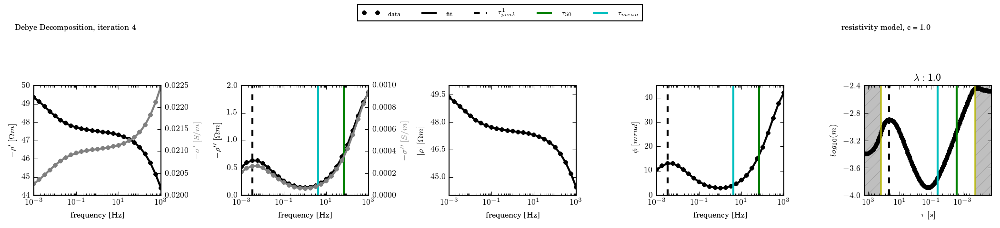

### Status

[Try ccd_tools on binder](https://mybinder.org/v2/gh/m-weigand/try-ccd-tools/master)

Cole-Cole decomposition routines
================================

## Introduction

This package contains an implementation of the Cole-Cole decomposition (CCD)
scheme, which is used in near-surface geophysical applications to describe
electrical polarization signatures measured for frequencies in the mHz range up
to multiple kHz.

In the CCD, spectral induced polarization (SIP) signatures are described by a
superposition of elementary polarization terms, which are suitably distributed
to cover at least the frequency range spanned by the measurement data.

For more information, please refer to the homepage of the project:
[https://m-weigand.github.io/ccd_tools](https://m-weigand.github.io/ccd_tools)

Parts of this code were described in two open-access publications:

[1. Weigand and Kemna, 2016, Computers and Geosciences](http://www.sciencedirect.com/science/article/pii/S0098300415300625)

[2. Weigand and Kemna, 2016, Geophysical Journal International](http://gji.oxfordjournals.org/content/205/3/1414)

## Versions

Please refer to the [Changelog.md](Changelog.md)

## Documentation

 * [Online version of the docs](https://m-weigand.github.io/ccd_tools/doc_ccd/introduction.html)
 * The sphinx-generated documentation is located in docs/doc

## Roadmap

The following functionality is planned to be implemented in the near future
(Q1-Q3 2018). After that, new feature will probably only be implemented when
required. For additional todo-items, please refer to the issues of this project
and to the file [TODO](TODO).

The current version is 0.8.12

### 0.9

* improve testing framework for **ccd_time**
* implement Cole-Cole decomposition (c less than 1) also for conductivity
  formulation
* improve Jupyter integration and provide examples

### 1.0

* proof-of-concept web interface
* implement the addition of a high-frequency EM-Cole-Cole term, decoupled from
  the other polarization terms

## Installation

Detailed [installation guide](https://m-weigand.github.io/ccd_tools/doc_ccd/installation.html)
for Windows and Linux.

Stable versions are released to pipy and can be installed using:

	pip install ccd_tools

Install the source package using setuptools:

    python setup.py build
    python setup.py install

The package can also be installed to a user-defined directory:

    export PYTHONUSERBASE=$HOME/inst/pip_installs
    export PYTHONPATH=$HOME/inst/pip_installs/lib/python3.4/\
        site-packages/:$PYTHONPATH
    python setup.py install --user
    export PATH=$HOME/inst/pip_installs/bin:$PATH

For developers:

    python seutp.py develop --user

To build the documentation:

    cd docs/doc
    make html

setuptools developer guide:

https://pythonhosted.org/setuptools/setuptools.html

### Using Jupyter Notebooks

We recommend installing and using Anaconda. Anaconda conveniently installs
Python, the Jupyter Notebook, and all needed packages for ccd-tools.

Use the following installation steps:

* Download [Anaconda](https://www.anaconda.com/download/#linux) with Python
3 version (currently Python 3.6).

* Install the version of Anaconda which you downloaded, following the instr
uctions on the download page.

* To install ccd-tools, open the Anaconda prompt and use the following command:

    `pip install ccd_tools`

* To run the Notebook within the Anaconda prompt, navigate to the notebook directory and use:

    `jupyter notebook`

This will print some information about the notebook server in your terminal,
including the URL of the web application (by default, http://localhost:8888).
It will then open your default web browser to this URL.
When the notebook opens in your browser, you will see the Notebook Dashboard,
including a list of the notebooks, files, and subdirectories of the directory
where the notebook server was started.

If Jupyter Notebooks are used with Virtualenvm, the Jupyter Widget JavaScript
library needs to be installed and enabled, using the following commands:

    pip install ipywidgets
    jupyter nbextension enable --py widgetsnbextension --sys-prefix

## Dependencies

Dependencies for the ccd tools are listed in the file
[requirements.txt](requirements.txt). When pip is used, all requirements can be
installed using:

	pip install -r requirements.txt

Additional requirements to build the documentation can be found in the file
[requirements_doc.txt](requirements_doc.txt), and can be installed using:

	pip install -r requirements_doc.txt

On Debian Linux systems, the following Python packages are required to run the
Cole-Cole decomposition routines:

	numpy
	scipy
	matplotlib
	geccoinv
	sip_models

In order to build the documentation, the additional packages are required: ::

	sphinx

Under Debian-related Linux systems, these packages can be installed using the
commands:

    sudo apt-get install texlive-latex-base texlive-latex-extra\
        texlive-fonts-recommended texlive-fonts-extra dvipng
    sudo apt-get install python2.7-numpy python-matplotlib python2.7-scipy\
        python-setuptools python-nose python-tornado

In order to build the documentation, the following sphinx-related packages must
be installed:

    sudo apt-get install python-sphinx
    sudo apt-get install python-sphinx python-sphinxcontrib.blockdiag
    pip install sphinxcontrib-programoutput

geccoinv and sip_models have to be installed according to their own documentation.

Under Windows, the program was tested using the 'pythonxy' distribution
(https://code.google.com/p/pythonxy/).

## Licence

This program is licenced under the GPL3 or later licence. See LICENCE.txt and
headers of individual files for more information.

Some third-party packages used for the homepage (gh-pages branch) have
individual licences.
