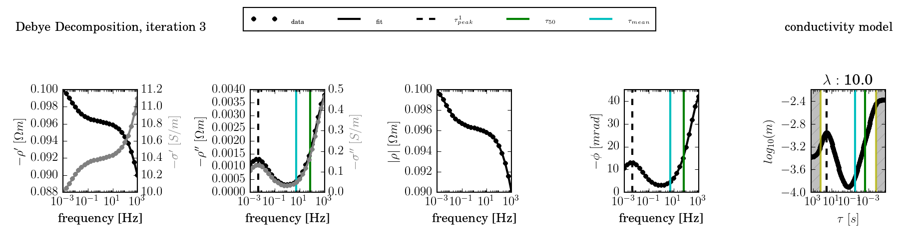

Getting Started
===============

This section describes the basic workflow for the decomposition of SIP spectra,
and provides two detailed usage examples.

Workflow
--------

.. blockdiag::

    blockdiag workflow{
        "data/frequencies" -> "batch file (.sh/.bat)";
        "batch file (.sh/.bat)" -> "execution";
        "execution" -> "output directory";
        "output directory" -> "post processing";
    }

Given one or more SIP spectra in form of a frequency file and a data file, the
decomposition commands could be called directly. However, given the large
number of possible command line options (and environment variables), it is
recommended to create a batch file with the command call. This ensures
reproducability and an easier management of settings. Decomposition output is
written to an output directory (in one of mulitple output formats), usually in
form of human readable ASCII text files. Following that, a (limited) amount of
postprocessing can be applied to the output directory.

Batch files
-----------

Windows
#######

Windows batch files usually have the ending `.bat` and can be executed by a
double click. Environment variables can be set using the `set` command. Given a
functional installation of the decomposition tools, a working batch file could
be: ::

    REM This is a windows bat file, execute by double clicking on it
    REM All lines starting with "REM" are comments, and will be ignored during execution.

    REM environment variables are set using the syntax:
    REM set [variable]=[value]

    set DD_COND=0
    set DD_STARTING_MODEL=3

    REM the decomposition command should be globally available
    REM Note that commands usually cannot span multiple lines.
    REM However, using the character "^" at the end of a line indicates a multiline command.
    REM Use this to structure commands for an better overview.

    dd_single.py -f frequencies.dat -d data.dat ^
     -n 20 -o results ^
     --tausel data_ext ^
     --nr_cores=1 --plot

Linux
#####

Linux shell files usually have the file ending `.sh`. A typical shell file for
a decomposition call is: ::

    #!/bin/sh
    # The first line indicates the program which executes this file

    # comment lines start with the character '#'

    # environment variables can be set using the command "export"

    export DD_COND=0
    export DD_STARTING_MODEL=3

    # multi-line commands use the character "\" to indicate a continuation over
    # multiple lines:
    dd_single.py -f frequencies.dat -d data.dat \
     -n 20 -o results \
     --tausel data_ext \
     --nr_cores=1 --plot

Environment variables can also be set only for a given command by prepending the assignment before the command::

    DD_COND=0 DD_STARTING_MODEL=3 dd_single.py -f frequencies.dat -d data.dat \
     -n 20 -o results \
     --tausel data_ext \
     --nr_cores=1 --plot

Linux shell files can be executed on the command line using the commands: ::

    ./[FILENAME].sh

or ::

    sh [FILENAME].sh

Example: Fitting one spectrum
-----------------------------

This example describes the process of fitting the following SIP spectrum using
a Debye decomposition scheme:

.. plot::

   import os
   os.environ['DD_USE_LATEX'] = "1"
   from NDimInv.plot_helper import *
   import numpy as np

   frequencies  = np.loadtxt('example1_single/frequencies.dat')
   data  = np.loadtxt('example1_single/data.dat')
   data = data.reshape((2, data.size / 2)).T

   fig, axes = plt.subplots(2, 1)
   ax = axes[0]
   ax.semilogx(frequencies, data[:, 0], '.', color='k')
   ax.set_xlabel('frequency [Hz]')
   ax.set_ylabel(r"$|\rho| [\Omega m]$")
   ax = axes[1]
   ax.semilogx(frequencies, -data[:, 1], '.', color='k')
   ax.set_xlabel('frequency [Hz]')
   ax.set_ylabel(r"$\phi [mrad]$")
   fig.tight_layout()

You need a frequency file which contains the frequencies, each in a seperate
line, in ascending order:

frequency.dat(:download:`Download frequencies.dat
(unix)<example1_single/frequencies.dat>`, :download:`Download frequencies.dat
(Windows)<example1_single/data_windows/frequencies.dat>`): ::

    0.0010
    0.0018
    0.0032
    0.0056
    0.0100
    0.0178
    0.0316
    0.0562
    0.1000
    0.1778
    0.3162
    0.5623
    1.0000
    1.7783
    3.1623
    5.6234
    10.0000
    17.7828
    31.6228
    56.2341
    100.0000
    177.8279
    316.2278
    562.3413
    1000.0000

Complex resistivity spectra are provided using a data file which holds a
spectrum in each line. Columns are separated by space and values are linear
both for magnitude and phase values. The first N columns correspond to the
magnitude values (:math:`\Omega m`) corresponding to the frequencies stored in
*frequencies.dat*. The following N columns represent the corresponding phase
values.

data.dat (:download:`Download data.dat (unix)<example1_single/data.dat>`,
:download:`Download data.dat
(Windows)<example1_single/data_windows/data.dat>`): ::

    49.345594 49.120225 48.860658 48.589371 48.333505 48.113950 47.939222\
    47.807051 47.709583 47.637735 47.583349 47.539704 47.501267 47.463162\
    47.420588 47.368190 47.299354 47.205358 47.074354 46.890271 46.632118\
    46.274900 45.794402 45.178163 44.441082 -10.526822 -12.095446 -13.004975\
    -12.999086 -12.088092 -10.544173 -8.744458 -7.007706 -5.526119 -4.380307\
    -3.584099 -3.124956 -2.990678 -3.184856 -3.735642 -4.701107 -6.172278\
    -8.272438 -11.148023 -14.941904 -19.734922 -25.441545 -31.665354\
    -37.581057 -41.99903

.. note::

    The previous listing for the data.dat file contains only one line. For
    display purposes, line breaks were introduced, and indicated by '\\'
    characters.

The spectrum can now be fitted to a Debye decomposition using the command
(:download:`download linux shell file<example1_single/run_dd1.sh>`,
:download:`download Windows shell file<example1_single/run_dd1.bat>`): ::

    dd_single.py -f frequencies.dat -d data.dat -o results1/

This call uses a line search to find an optimal lambda value, and saves fit
results in the directory **results1/**. The `--plot` option results in the last
iteration being plotted:

.. image:: example1_single/results1/plot_spec_000_iteration0005.png
    :align: center

The fit can be further controlled by providing a fixed lambda value
(`--lambda`) and by using an advanced starting model (nr 3, using the
environment variable **DD_STARTING_MODEL**):

Windows (:download:`download Windows batch file<example1_single/run_dd2.bat>`): ::

    set DD_STARTING_MODEL=3
    dd_single.py -f frequencies.dat -d data.dat -o results2 --plot --lambda 10

Unix (:download:`download linux shell file<example1_single/run_dd2.sh>`)::

    DD_STARTING_MODEL=3 dd_single.py -f frequencies.dat -d data.dat -o results2\
     --plot --lambda 10

.. image:: example1_single/results2/plot_spec_000_iteration0005.png
    :align: center

The conductivity model can be activated using the environment variable **DD_COND**:

Windows (:download:`download Windows batch file<example1_single/run_dd3.bat>`): ::

    set DD_STARTING_MODEL=3
    set DD_COND=1

    dd_single.py -f frequencies.dat -d data.dat -o results --plot --lambda 10

Linux (:download:`download linux shell file<example1_single/run_dd3.sh>`): ::

    DD_STARTING_MODEL=3 DD_COND=1 dd_single.py -f frequencies.dat -d data.dat\
     -o results3 --plot --lambda 10 --norm 10

Example: Fitting multiple spectra using a time regularisation
-------------------------------------------------------------

* Example multiple spectra dd_time (including post-plotting)
