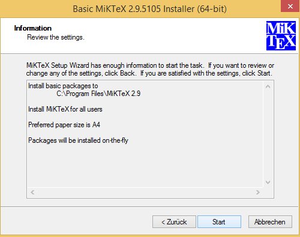

Windows
=======

The installation for the Windows operating system consists of the following steps:

* Installation of a suitable Python distribution
* (optional) Installation of the MiKTex Latex distribution (under Windows,
  Latex support is disabled by default, and has to be activated using the
  corresponding environment variable).
* Installation of the Debye decomposition tools

There are multiple suitable Python distributions to choose from. At the moment the Anaconda distribution is recommended: http://continuum.io/downloads (use Python 2.7, 64 bit)

In the following, please install only one of the Python distributions, and then
proceed with the installation of the DD-Tools, and optionally the MikTex
distribution.

Anaconda
--------

* Download the Python 2.7, 64 bit version of the Anaconda distribution:
  http://continuum.io/downloads

* Start by opening the file manager in the download directoy:

  .. image:: install/windows/anaconda/file_explorer.png
    :scale: 65%

* The following screenshots show the steps of the setup wizard. Usually all
  presets can be accepted by clicking on the 'next' button.

  .. image:: install/windows/anaconda/setup1.png
    :scale: 65%

  .. image:: install/windows/anaconda/setup2.png
    :scale: 65%

  .. image:: install/windows/anaconda/setup3.png
    :scale: 65%

  .. image:: install/windows/anaconda/setup4.png
    :scale: 65%

.. warning::

    Note that Anaconda (as tested in Juli, 2015) does not register the .py
    extension with the Python interpreter. That means that, at this point, you
    cannot click on a Python file and execute it as any executable. The
    following screenshots show you how to register Python with the **.py**
    extension.

* Find the file **fix_registry_windows.py** that resides in the root directory
  of the zip-archive (or the extracted directory). Note that sometimes the file
  extension *.py* is not shown.  Right click on the file, and select
  "Properties".

  .. image:: install/windows/anaconda/setup5.png
    :scale: 65%

* Find the line starting with "Opens with:", and select "Change"

  .. image:: install/windows/anaconda/setup6.png
    :scale: 65%

* A new window opens that lists all available programs registered with the
  operating system. Choose "Look for another app on this PC" at the bottom.

  .. image:: install/windows/anaconda/setup7.png
    :scale: 65%

* A normal file-open dialog appears. Select the python.exe binary in the
  Anaconda installation directory (here: **C:\\Users\Maximilian\\Anaconda**),
  and click "open".

  .. image:: install/windows/anaconda/setup8.png
    :scale: 65%

* Finally, the properties dialog of the python file should look like this:

  .. image:: install/windows/anaconda/setup9.png
    :scale: 65%

*
  .. image:: install/windows/anaconda/setup10.png
    :scale: 65%

Installing the DD tools
-----------------------

* The DD tools are provided in **.zip** file which contains the source code,
  the documentation, examples, and a Windows installation file. Extract the
  archive file to a new directory:

  .. image:: install/windows/dd_tools_msi/setup01.png

* We provide a MSI-Installation file called **dd_tools_0.5.4.win.amd64.msi**
  (the version number can vary). Execute this installer by double clicking on
  it, and follow the installation instructions (usually all preset settings can
  be accepted by clicking 'next').

  .. image:: install/windows/dd_tools_msi/setup02.png

* After the installation, open the following subdirectory in the extracted
  directory: **dd_interfaces/examples/dd_single/01**. Execute the file
  **run_dd** by double clicking on it:

  .. image:: install/windows/dd_tools_msi/setup03.png

* A terminal window should appear with the output of the call.

  .. image:: install/windows/dd_tools_msi/setup04.png

  The window should close itself after the decomposition finished. The
  installation was successful if a directory **results/** was created with the
  fit results.

(optional) Installing MiKTex
----------------------------

* MiKTex can be obtained from the homepage http://miktex.org/download.

.. note::

    We had some problems and long waiting times during the installation of
    MiKTex. Therefore we disabled the Latex support in the DD tools for the
    Windows installation, and made MiKTex an optional requirement.

.. image:: install/windows/miktex/setup01.png
    :scale: 65%

.. image:: install/windows/miktex/setup02.png
    :scale: 65%

.. image:: install/windows/miktex/setup03.png
    :scale: 65%

.. image:: install/windows/miktex/setup04.png
    :scale: 65%

.. image:: install/windows/miktex/setup05.png
    :scale: 65%

.. image:: install/windows/miktex/setup07.png
    :scale: 65%
