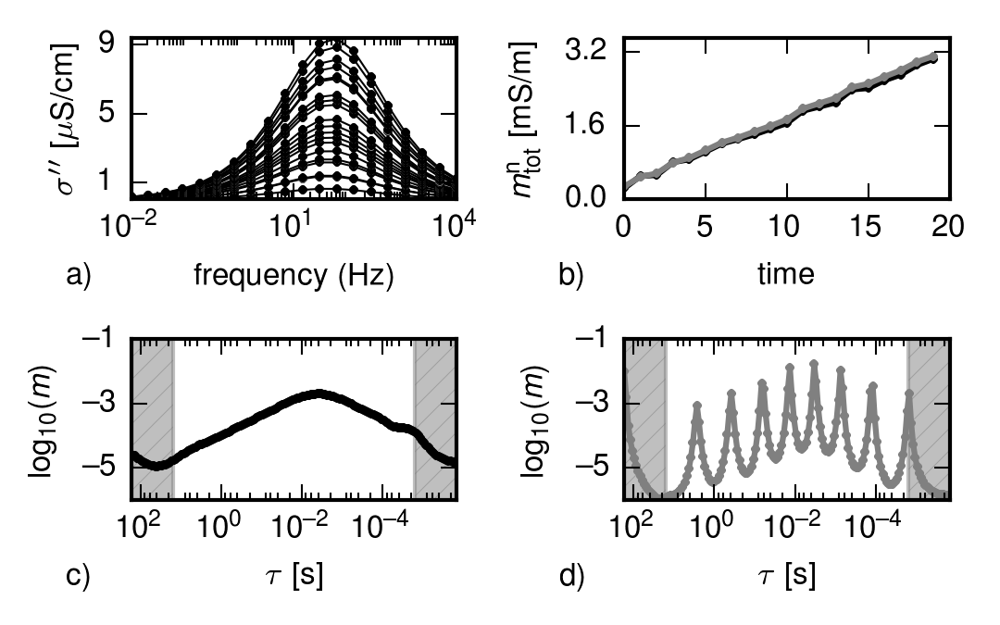

dd_time.py
==========

Command line options
--------------------

.. program-output:: dd_time.py -h

Usage Examples
--------------

Output Format
-------------

The output file match the output files of the :doc:`dd_single`
program (see here for detailed documentation of all output files:
:ref:`ref_dd_single_output_format`) except for the following changes:

* the file *times.dat* contains the time strings as read from the input files.
  One time per line.

* *rho_normalizations.dat* contains normalization factors if the option
  ``--norm_mag`` was used.

Regularisation Parameters
-------------------------

The selection of appropriate regularisation parameter values is a non-trivial
task for ill-posed inverse problems. In the present case this particularly
holds for the time regularisation, which competes with the frequency
regularisation. The figure shows an example which highlights the importance of
appropriately balancing frequency and time regularisations. Unimodal SIP
responses were generated using the Cole-Cole model with increasing
chargeability over time (a). Based on these data, DDs were performed using two
different time regularisations: one characterised by reasonably balanced time
and frequency regularisation parameters, and one where time regularisation was
dominant. The resulting temporal evolution of :math:`m_{tot}^n` for both cases
is shown in (b) and the corresponding RTDs for time step 10 are shown in c and
d, respectively. Although the temporal evolution of :math:`m_{tot}^n` is very
similar in both cases, a too strong time regularisation effectively neutralises
the frequency regularisation and leads to a highly fluctuating RTD (c). 

(figure taken from ``src/dd_single/characterisation/TooMuchTimeReg``).
